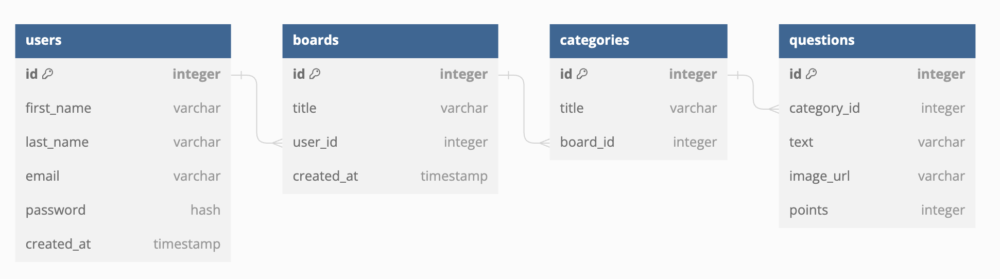

# jeapordy-maker
An online tool for creating jeapordy quiz games.

## Set up
Instructions for how to install dependencies and run the project.

### Frontend
The code for the front end of jeapordy maker is contained within `/src/frontend`. The front end is written in [React](https://react.dev/), and uses [Parcel](https://parceljs.org/docs/) as a build tool. Dependencies are managed via [yarn](https://classic.yarnpkg.com/lang/en/docs/install/#mac-stable).

To install dependencies, first navigate to the frontend folder
```
cd src/frontend
```
and then install dependencies
```
yarn install
```
Once dependencies have been installed you can run the frontend using the "start" script
```
yarn run start
```

### Backend
TODO

## Database Design
Here is our schema for the database:



Users can create multiple boards which contain multiple categories and questions.

When playing a game, participants for the game are stored as JSON objects in localstorage. This is so that they'll
persist through refreshes, but there isn't any overhead for storing them in the database.